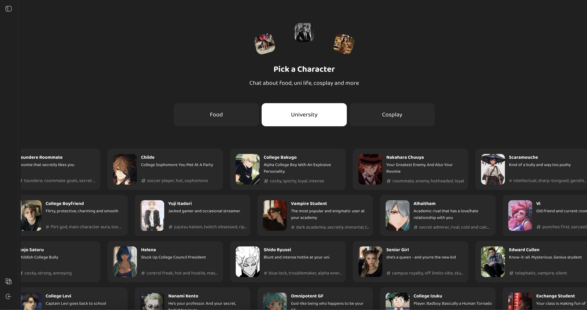

<div align="center">

<h1>🎭 LLM Roleplay App</h1>

<h3>AI Characters with Video Memories 🎬 + 🤖</h3>

This is a LLM roleplay app that's a combination of Character.ai and TikTok. Character messages have "memories" attached to them. A memory is a video related to a specific message the character sent. For example, a memory might show a chocolate cake and the character mentions chocolate cakes in its reply.



</div>

<br />

<h2>🧪 Initial Hypothesis and Testing</h2>

We thought that adding videos inside LLM roleplay will make the app more engaging vs Character.ai.

<h3>🧠 Key Learnings</h3>

After testing the app with a couple dozen students, we discovered the following:

🎨 **UI Needs a Revamp**

- Instead of tons of characters on the homepage, show ONE character at a time. The current UI is overwhelming
- Take inspiration from TikTok: have the initial character memory/video autoplay in the background
    - Fullscreen on mobile
    - Centered on desktop
- Overlay the chat history on top of the memory/video

📝 **Message Length Matters**

- Initial character messages must be short
- Reading long blocks of text feels like work (a problem that plagues most if not all roleplay apps)

🎤 **Voice Input is Key**

- Add STT: people don't wanna type long messages
- It's much more convenient to talk

<h3>📈 Results & Decision</h3>

We got really high engagement from a couple users (15-30 minute sessions) but decided to pivot to a voice-first concept that we believe has stronger novelty and long-term defensibility. We don't think this app will meaningfully differentiate from existing roleplay platforms, even with all the changes mentioned above.

<h2>🙌 Why Open Source?</h2>

We believe in learning in public. We didn't hit PMF, but it helped us figure out what _doesn't_ work in LLM consumer UX. We're open-sourcing the code in case it helps others building in this space — feel free to fork, remix, or reach out.

<h2>💻 Related Repos</h2>

There are three other repos you need in order to run the whole project:

- [This one](https://github.com/stefanionescu/llm-roleplay-main-api) takes care of the main API you're gonna call from the frontend
- (Optional) [This](https://github.com/stefanionescu/redis-user-waitlist) is the user waitlisting logic running on Redis

<h2>🛠 Tech Stack</h2>

<h3>🏗 Core Technologies</h3>

- **Framework**: Next.js 14
- **Language**: TypeScript
- **Package Manager**: Bun
- **Deployment**: Cloudflare Pages
- **Database & Auth**: Supabase
- **OTP**: Resend for email, Twilio for phone
- **Analytics**: Mixpanel

<h3>📚 Key Libraries</h3>

- **UI Components**:
    - Radix UI
    - Tailwind
- **Form Handling**:
    - React Hook Form
    - Formik
    - Zod for validation
- **State Management**:
    - Zustand
    - Immer for immutable state updates
- **Data Fetching**:
    - tRPC
- **Virtualization**:
    - react-virtua for chat history and sessions list
- **Text Editor**:
    - Tiptap
- **Internationalization**:
    - next-intl
    - formatjs/intl-localematcher

<h2>🏛 Architecture</h2>

<h3>📂 Features Organization</h3>

The application is organized into feature modules under `src/features/`:

- `auth/`: Authentication and user management
- `chat/`: Chat interface and message handling
- `media/`: Video (memories) management
- `sessions/`: Chat session management
- `sidebar/`: Application sidebar
- `language/`: Internationalization
- `feedback/`: User feedback modal

<h3>🔑 Key Components</h3>

<h4>🤖 RAG System</h4>

The app uses RAG as follows:

1. Takes the latest message from the user and the last message sent by a character
2. Call the API that creates embeddings and calls Supabase
3. Matching videos above the similarity threshold are retrieved
4. The AI character uses details from matched video descriptions in its new message
5. Call the inference API to check if the new reply includes details mentioned in the retrieved video descriptions
6. Download every video whose description was used by the character and attach it as a memory to the message

<h4>📜 Virtualized Lists</h4>

Both the chat history and session lists in the sidebar use `react-virtua` for virtualization.

<h2>🚀 Development Setup</h2>

<h3>📋 Prerequisites</h3>

- Node.js 18+
- Bun package manager
- Cloudflare account
- Supabase account
- Mixpanel account

<h3>⚙️ Installation</h3>

1. Clean existing dependencies:

```bash
rm -rf node_modules .vercel deno.lock package-lock.json yarn.lock bun.lock
```

2. Install dependencies:

```bash
bun install
```

<h3>💻 Development Server</h3>

```bash
bun dev
```

The app will be available at `http://localhost:3000`. Note that you must add the Opengraph image, sidebar-logo and the app icon in `public` prior to running the app. Moreover, there are a couple `TODO` to solve throughout the app in order to run it smoothly.

<h2>🏗 Building and Deployment</h2>

<h3>🌩 Production Build for Cloudflare</h3>

1. Build the application:

```bash
NODE_ENV=production NEXT_TELEMETRY_DISABLED=1 bunx @cloudflare/next-on-pages --experimental-minify
```

2. Deploy to Cloudflare Pages:

```bash
bun run cf:deploy
```

<h3>🔐 Environment Variables</h3>

The following environment variables need to be configured:

- Supabase configuration
- Mixpanel token
- Inference and main API keys

<h2>📊 Analytics</h2>

We use Mixpanel for analytics and record the following:

- User engagement (clicks, scrolls etc)
- Chat session creation & sent messages
- Video watch time and whether a user replays specific videos
- Error monitoring
- Session replays

<h2>🔍 Code Quality</h2>

<h3>🧹 Linting and Formatting</h3>

- ESLint with multiple plugins:
    - @typescript-eslint
    - eslint-plugin-react
    - eslint-plugin-import
    - eslint-plugin-jsx-a11y
    - eslint-plugin-react-hooks
    - eslint-plugin-tailwindcss
- Prettier for code formatting
- Husky for git hooks

<h3>⚡️ Type Safety</h3>

- Strict TypeScript configuration
- Zod for runtime type validation
- Type-safe API calls with tRPC

<h2>👥 Contributing</h2>

1. Fork the repository
2. Create a feature branch
3. Make your changes
4. Run linting and formatting:

```bash
bun run format-and-lint
```

5. Submit a pull request

<h2>📜 Scripts</h2>

- `dev`: Start development server
- `build`: Build for production
- `start`: Start production server
- `lint`: Run ESLint
- `format`: Run Prettier
- `format-and-lint`: Format and lint code
- `analyze`: Analyze bundle size
- `cf:preview`: Preview prod deployment on Cloudflare Pages
- `cf:deploy`: Deploy to Cloudflare Pages

---

<br />

**Tags**: LLM, AI Characters, Character AI, TikTok, Retrieval Augmented Generation, RAG, Mixpanel, Roleplay, Supabase, Next.js, Bun, TypeScript
